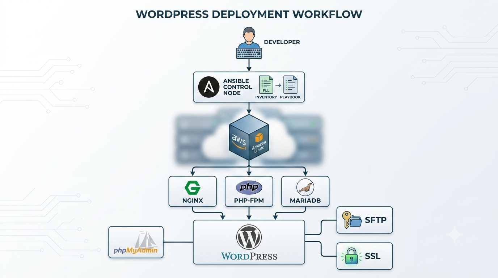
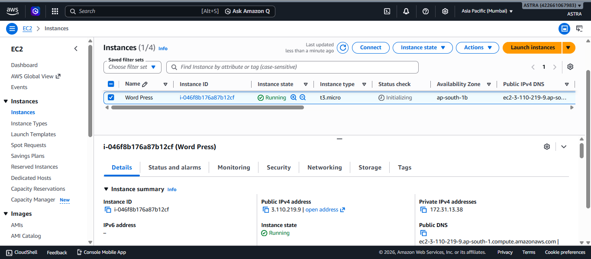
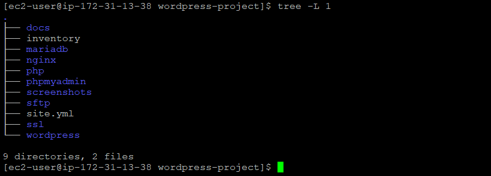
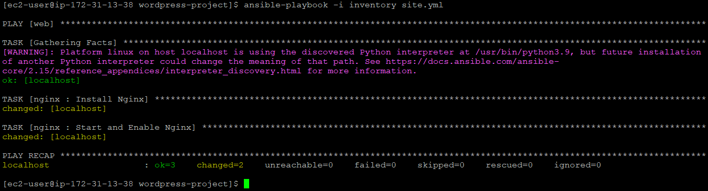
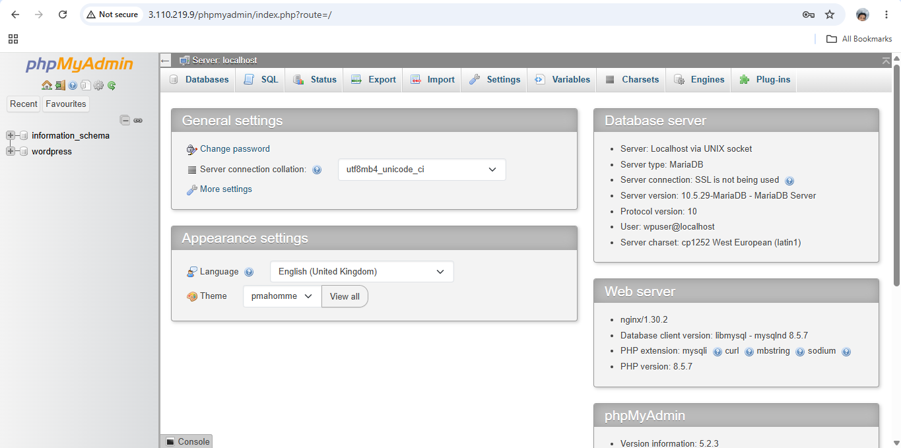
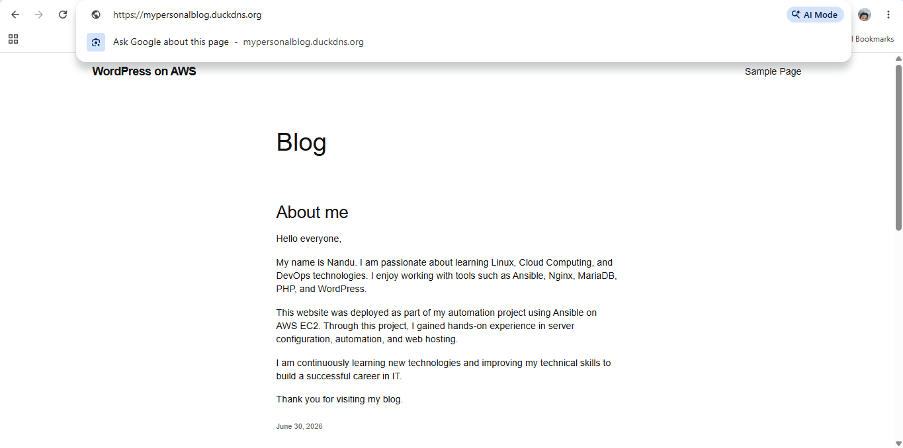
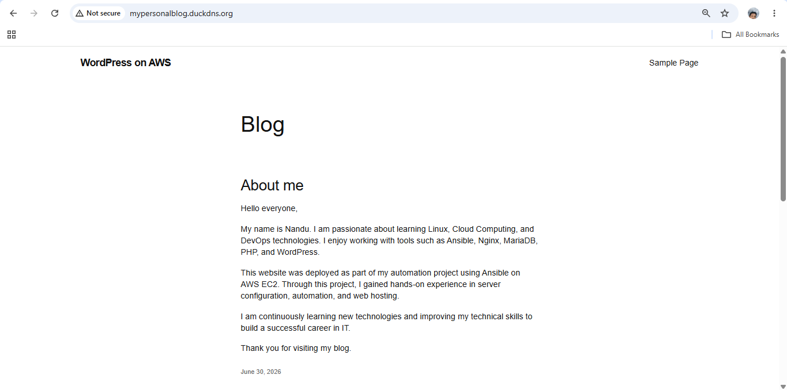

#  Automated WordPress Deployment with Ansible on AWS EC2 (Linux)


##  Project Overview

This project automates the deployment of a secure **WordPress hosting environment** on **AWS EC2 (Amazon Linux 2023)** using **Ansible Roles**. Following the principles of **Infrastructure as Code (IaC)**, the solution automates the installation and configuration of **Nginx**, **PHP**, **MariaDB**, **WordPress**, **phpMyAdmin**, **SFTP**, and **Let's Encrypt SSL**, delivering a secure, consistent, and repeatable deployment process.


# 📖 Architecture

<p align="center">

</p>


# ✨ Features

- 🚀 Infrastructure as Code (IaC)
- ⚙️ Automated WordPress Deployment
- 📦 Modular Ansible Role-Based Architecture
- 🌐 Nginx Web Server Configuration
- 🐘 PHP Installation & Configuration
- 🗄️ MariaDB Database Setup
- 📝 WordPress Deployment
- 💻 phpMyAdmin Integration
- 🔐 Secure SFTP Configuration
- 🌍 DuckDNS Domain Integration
- 🔒 HTTPS using Let's Encrypt SSL


# 🛠 Technologies Used

| Category | Technology |
|-----------|------------|
| Cloud Platform | AWS EC2 |
| Operating System | Amazon Linux 2023 |
| Automation | Ansible |
| Web Server | Nginx |
| Database | MariaDB |
| CMS | WordPress |
| Programming Language | PHP |
| Database Tool | phpMyAdmin |
| Secure File Transfer | OpenSSH (SFTP) |
| SSL | Certbot & Let's Encrypt |
| Version Control | Git & GitHub |


# 📂 Project Structure

```text
wordpress-project/
├── ansible.cfg
├── inventory
├── site.yml
├── roles/
│   ├── nginx/
│   ├── php/
│   ├── mariadb/
│   ├── wordpress/
│   ├── phpmyadmin/
│   ├── sftp/
│   └── ssl/
├── docs/
│   └── Automated-WordPress-Deployment-with-Ansible.pdf
├── screenshots/
└── README.md
```


# ⚙️ Deployment Workflow

```text
AWS EC2
    │
    ▼
Ansible Playbook
    │
    ▼
Ansible Roles
    │
    ├── Nginx
    ├── PHP
    ├── MariaDB
    ├── WordPress
    ├── phpMyAdmin
    ├── SFTP
    └── SSL
    │
    ▼
Fully Automated WordPress Website
```


# 📷 Project Screenshots

## AWS EC2 Infrastructure




## Project Structure

<p align="center">

</p>


## Main Ansible Playbook

<p align="center">

</p>


## Nginx Role Execution


## WordPress Installation Wizard


## WordPress Dashboard




## Domain Configuration




## Final Project Output



---

# 📚 Documentation

Complete project documentation is available in the **docs** directory.

```text
docs/
└── Automated-WordPress-Deployment-with-Ansible.pdf
```


# 👨‍💻 Author

**Nandu Sivadas**

Cloud & DevOps Enthusiast

- LinkedIn: https://www.linkedin.com/in/nandu-sivadas-556264396

---
